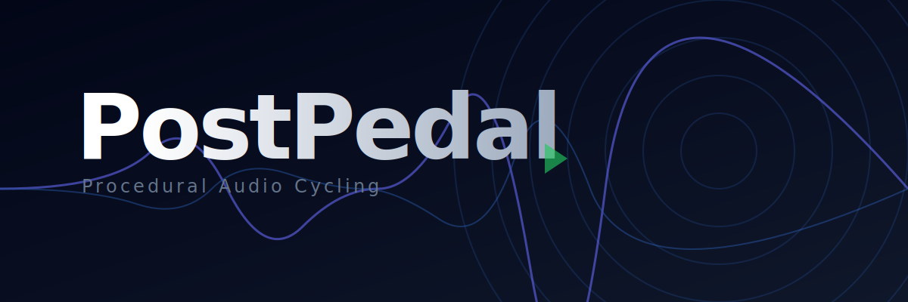
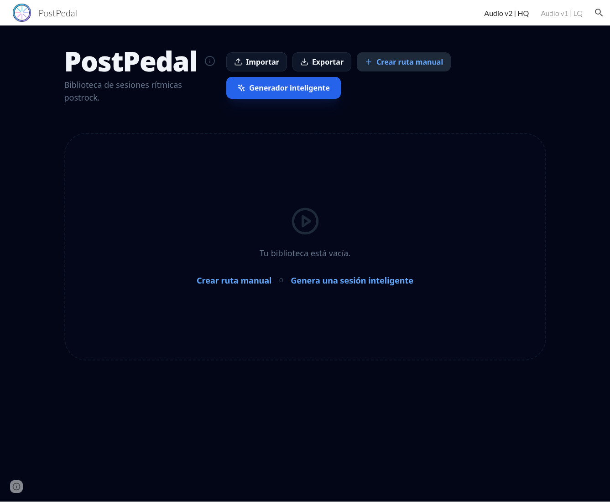
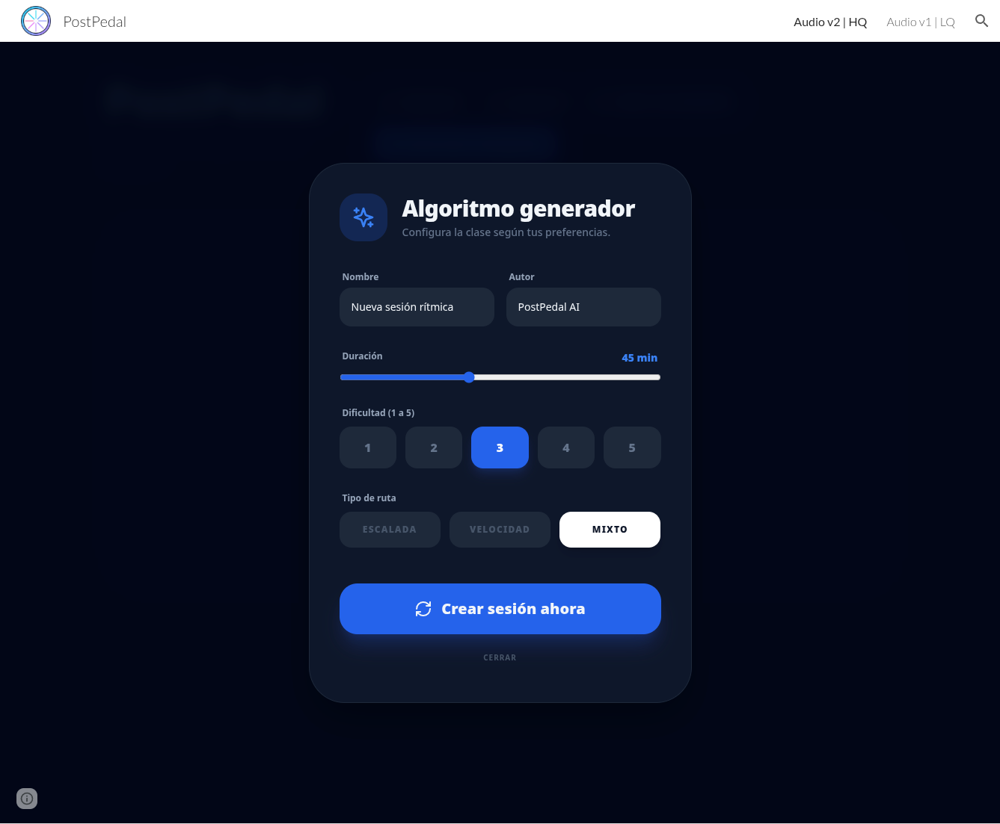
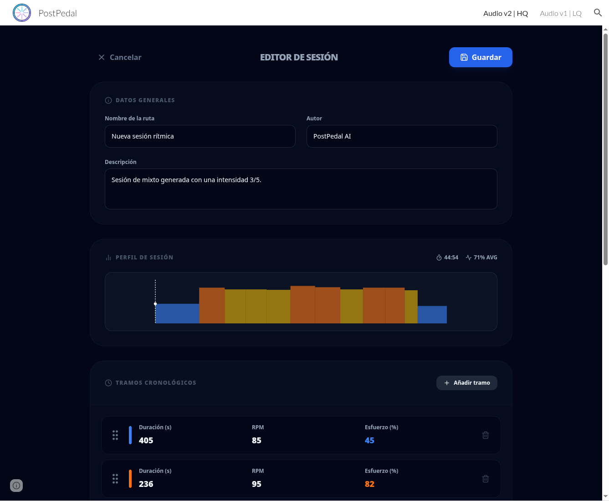
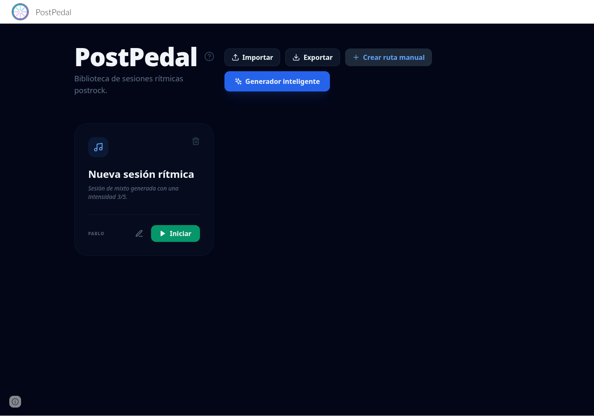
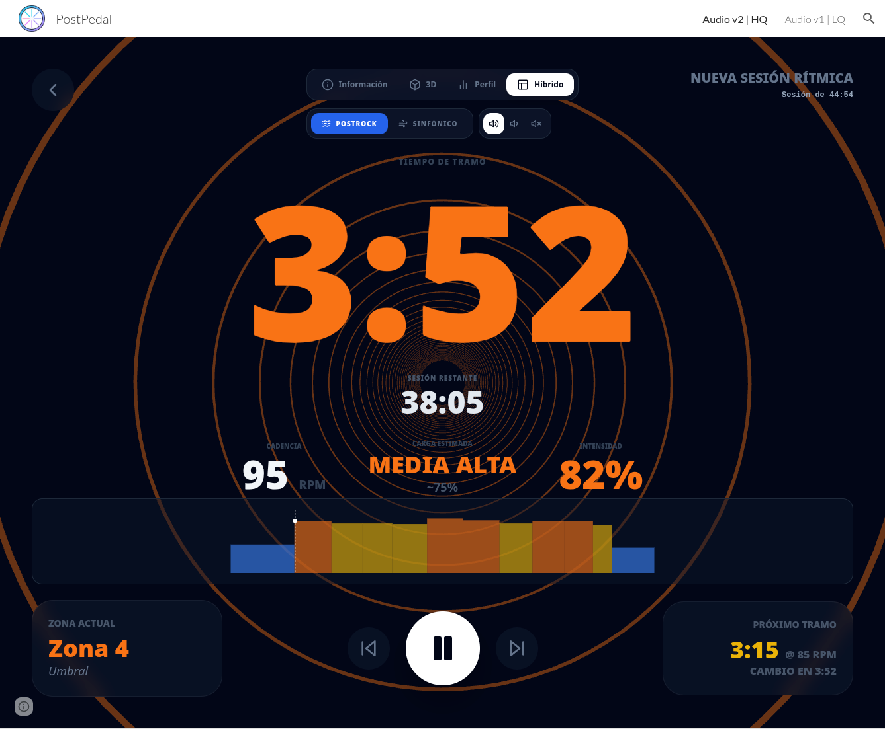
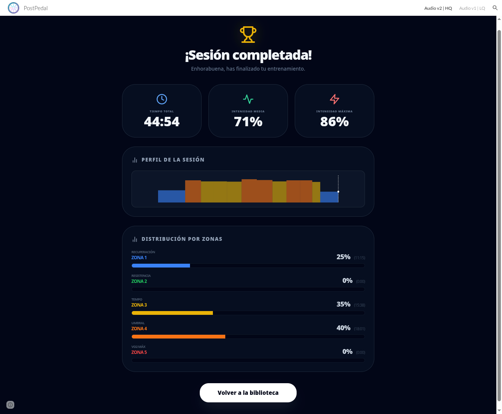

  

# PostPedal 🚴‍♂️🎸

> **El Manifiesto Anti-Reggaeton hecho código.**  
> Entrena tus piernas mientras viajas por el espacio con audio generado en tiempo real.

🔴 **Úsalo ahora mismo en:** [https://postpedal.pablofelip.online](https://postpedal.pablofelip.online)

---

## 🧐 ¿Por qué existe esto?

Desde septiembre de 2025, el ciclo indoor se ha convertido en mi terapia. Los monitores son cracks, el ejercicio es brutal y mi salud mental lo agradece. ¿El problema? **La música.**

Mi tolerancia al ácido láctico ha mejorado, pero mi tolerancia al perreo intenso sigue bajo mínimos. 😅

**PostPedal** es mi pequeña "protesta virtual". Nace de la necesidad vital de pedalear sintiéndome el protagonista de una película épica del espacio y no en una discoteca a las 3 de la mañana (algo que, por otro lado, se me da fatal).

Si quieres sufrir en la bici, hazlo con clase y mirando a las estrellas.

## ✨ Características Principales

Esta no es una app de reproducción de MP3. Aquí hay **ciencia y ruido**:

*   🎶 **Motor de Audio Procedural (`RhythmicEngine`):**
    *   No hay archivos de audio pregrabados. Toda la música se genera en tiempo real usando la **Web Audio API**.
    *   **Modo Postrock:** Ondas de sierra desafinadas para crear muros de sonido densos.
    *   **Modo Sinfónico:** Texturas espaciales y melodías generativas.
    *   El audio reacciona a tu esfuerzo: la música se vuelve más intensa y "ruge" cuando subes la intensidad.
*   🌀 **Túnel Hipnótico 3D:** Una visualización construida con **Three.js** que reacciona a tus RPM y vatios. Diseñada para que te quedes mirando al centro y olvides que te arden los cuádriceps.
*   🧠 **Generador de Sesiones Inteligente:** ¿No sabes qué hacer hoy? Dile cuánto tiempo tienes y cuánto quieres sufrir (del 1 al 5). El algoritmo creará una ruta con calentamiento, picos de intensidad y enfriamiento.
*   ✏️ **Editor Manual:** Crea tus propias tablas de tortura arrastrando y soltando tramos.
*   💾 **Persistencia Local:** Tus rutas se guardan en el navegador. Importa y exporta tu biblioteca en JSON para compartirla (o para hacer copias de seguridad).

## 📸 Galería

  
  
  
  
  
  

 

## 🛠 Tecnologías

Esta aplicación es una demostración de lo que se puede hacer con los estándares web modernos **sin necesidad de pasos de compilación complejos** (bundlers). Es un único archivo HTML supervitaminado.

*   **React 18** (vía ESM/Import Maps): Para la interfaz de usuario.
*   **Web Audio API:** El corazón del sintetizador. Osciladores, ganancias, filtros biquad y delays en tiempo real.
*   **Three.js:** Para los gráficos 3D del túnel.
*   **Tailwind CSS:** Para que la interfaz se vea bonita sin escribir mil líneas de CSS.
*   **Lucide React:** Iconografía.
*   **Babel Standalone:** Para procesar JSX al vuelo en el navegador.

## 🚀 Instalación y Uso Local

Lo mejor de este proyecto es su simplicidad arquitectónica.

1.  **Descarga el archivo:** Basta con descargarse el archivo `index.html` de este repositorio.
2.  **Abre el archivo:** Haz doble clic sobre `index.html` para abrirlo en tu navegador favorito (Chrome, Firefox, Edge...). No se han detectado problemas de funcionamiento al usarlo localmente incluso en ausencia de un servidor web ligero.

¡Y a pedalear!

## 🤝 Contribuyendo

¿Sabes de teoría musical y quieres mejorar los acordes procedurales? ¿Eres un mago de los shaders y quieres mejorar el túnel 3D? ¡Los PRs son bienvenidos!

Ayúdame a hacer que el motor de audio suene menos "experimental" y más "banda sonora de Hans Zimmer".

## ✍️ Autor

**Pablo Felip**

*   💼 [LinkedIn](https://www.linkedin.com/in/pfelipm/)
*   🐦 [Twitter / X](https://twitter.com/pfelipm)
*   💻 [GitHub](https://github.com/pfelipm)

## 📄 Licencia

Este proyecto se distribuye bajo los términos del archivo [LICENSE](./LICENSE).
